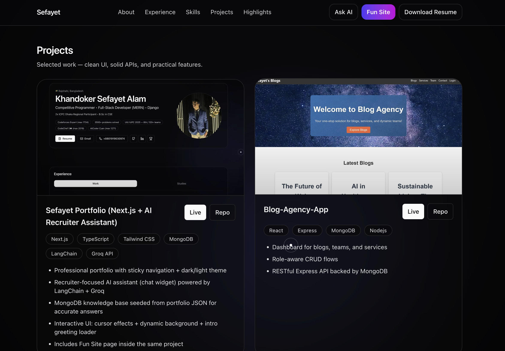
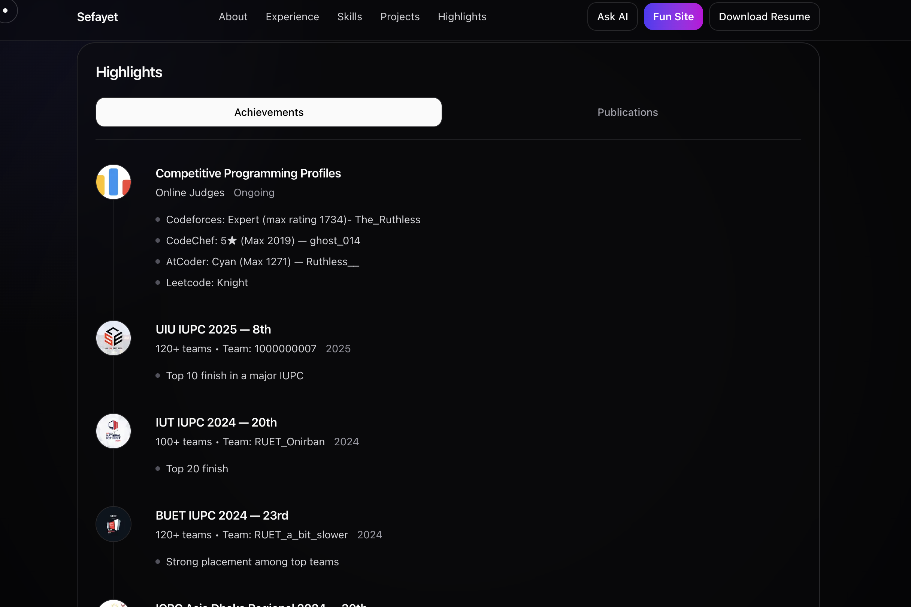
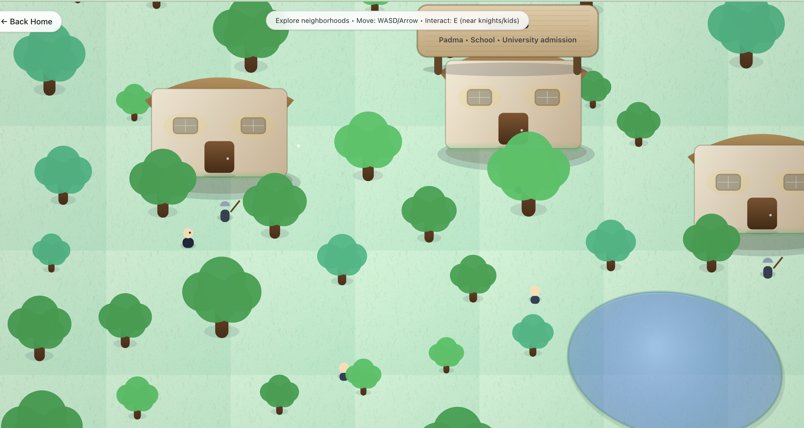
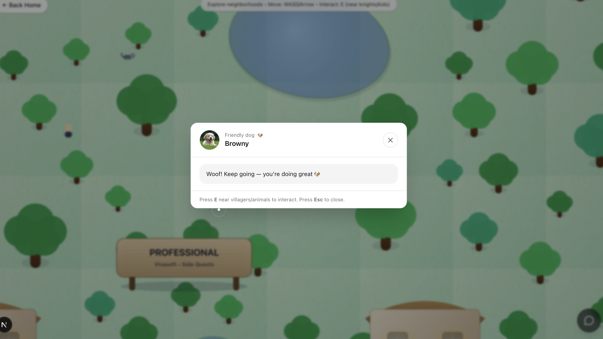
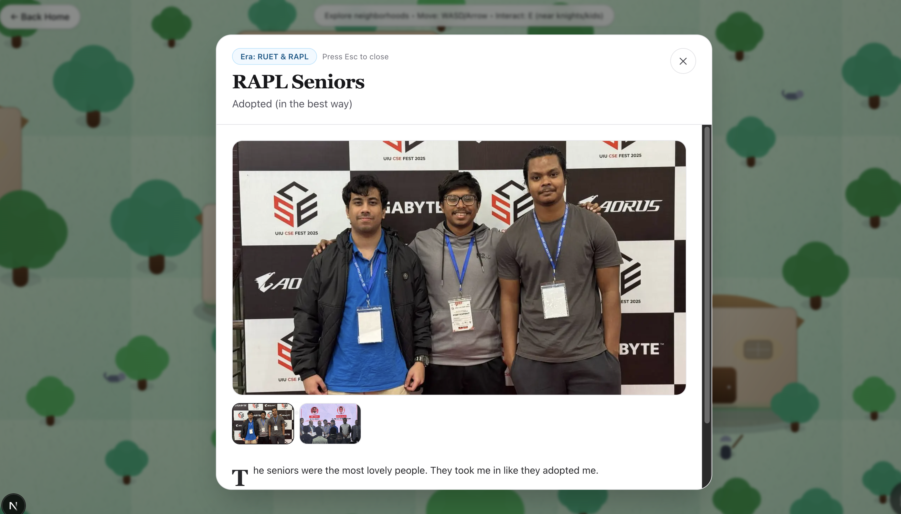

# Sefayet Portfolio (Next.js + MongoDB + AI Recruiter Assistant)

A professional, recruiter-first portfolio with:
- Minimal, classy main site (fast scanning in 10–20 seconds)
- AI Recruiter Assistant (“Sef-AI-yet”) trained on my own knowledge base (MongoDB)
- A fun exploration page (2D village) with stories & moments
- Dark / light mode + interactive UI effects

---

## Live
- Live URL: [Sefayet-Alam](https://sefayet-alam.vercel.app/)
- Repo: this repository

---

## The files are in 
/Users/sefayet/sefayet-portfolio in my Mac

---
## Screenshots

Screenshots are stored in:
public/Screenshots/ss1.png → ss7.png

---

## Motivation & Goal

Recruiters scan portfolios extremely fast. My goal was to build something that:
- Communicates who I am + what I can do in seconds
- Proves skill through projects + achievements + certificates
- Adds an AI Recruiter Assistant so a recruiter can ask questions like:
  - “What’s his expected salary?”
  - “Summarize his strongest skills”
  - “What did he build in MERN / LangChain?”
  - “What competitions did he participate in?”

If something is missing, the assistant directs them to contact me:
- Phone: +8801919030974
- Email: sefayetalam14@gmail.com

---

## Tech Stack

Frontend
- Next.js (App Router) + TypeScript
- Tailwind CSS
- Lucide icons
- Motion/hover effects + custom cursor + background FX

AI Assistant
- LangChain
- Groq API (LLM)
- Prompt rules for recruiter-friendly output:
  - short answers
  - plain bullets (no heavy markdown)
  - always provide contact fallback if missing context

Database (Knowledge Base)
- MongoDB (local dev via MongoDB Community + Compass)
- Collection: kb_chunks
- Stores small “chunks” like:
  - salary expectations
  - projects summary
  - experience bullets
  - achievements, certificates
  - common recruiter FAQs

Fun Page (2D)
- Kaboom.js (client-only canvas game)
- World data stored in public/fun/world.json
- Easy to add new “stops” (houses) / NPC dialogues

---

## Key Features

Recruiter-first layout
- Hero
- Experience (work / studies)
- Skills (icons)
- Projects (cards with images + buttons)
- Certificates & Licenses (projects-like cards)
- Highlights/Achievements + Publications
- Footer contact + social

AI Recruiter Assistant (“Sef-AI-yet”)
- Floating chat widget (doesn’t affect scrolling)
- Retrieves relevant KB chunks from MongoDB
- Answers in short bullet points
- If KB doesn’t contain an answer → contact fallback (phone/email)

Fun page (2D village)
- Full-screen
- Permanent “Back to Home”
- Neighborhoods represent phases of life
- Houses (stops) open story overlays
- Kids/NPCs provide friendly interactions

---

## Project Structure (High Level)

src/
  app/
    page.tsx                main site
    fun/page.tsx            fun game page
    api/
      chat/route.ts         AI chat endpoint
      admin/route.ts        seed/admin endpoint (token protected)
  components/
    layout/                 Header, Footer
    sections/               Hero, Experience, Skills, Projects, Certifications, Achievements
    ui/                     ChatWidget, CursorFx, BackgroundFx, IntroLoader, theme toggle etc.
  lib/
    ai/                     Groq, prompt, retrieval
    db/                     Mongo connection + collections
content/
  portfolio.seed.json       portfolio content used by UI
public/
  Screenshots/              ss1.png → ss7.png
  fun/world.json            fun game world data
  projects/                 project images
  certs/                    certificate images

---

## Local Setup (Step-by-step)

0) Requirements
- Node.js (recommended: 18+ or 20+)
- MongoDB Community Server
- MongoDB Compass (optional but helpful)

1) Clone the repo
  git clone <YOUR_REPO_URL>
  cd <YOUR_REPO_FOLDER>

2) Install dependencies
  npm install

3) Create .env.local
Create a file named .env.local in the project root and paste:

  MONGODB_URI=mongodb://127.0.0.1:27017/sefayet_portfolio
  GROQ_API_KEY=your_groq_key_here
  ADMIN_TOKEN=dev_seed_token

4) Start MongoDB locally

Option A (Homebrew services):
  brew list | grep mongodb
  brew services start mongodb-community@6.0

Verify MongoDB:
  mongosh "mongodb://127.0.0.1:27017/sefayet_portfolio" --eval "db.runCommand({ ping: 1 })"

Option B (MongoDB Compass):
Connect using:
  mongodb://127.0.0.1:27017

5) Seed KB data (so AI can answer properly)

Method 1: Import JSON via Compass
- Database: sefayet_portfolio
- Collection: kb_chunks
- Import your KB JSON (array of documents)

Verify:
  mongosh "mongodb://127.0.0.1:27017/sefayet_portfolio" --eval "db.kb_chunks.countDocuments()"

Method 2: Use Admin API (token protected)
If your repo includes seeding logic:
  curl -i -X POST http://localhost:3000/api/admin -H "x-admin-token: dev_seed_token"

6) Run dev server
  npm run dev

Open:
  http://localhost:3000

---

## If I Lost My PC / New Laptop Setup (Checklist)

- Install Node.js
- Install MongoDB Community + Compass
- git clone ...
- npm install
- Create .env.local (MONGODB_URI, GROQ_API_KEY, ADMIN_TOKEN)
- Start MongoDB
- Seed/import kb_chunks
- npm run dev
- Done

---

## How to Update Content (Fast)

Portfolio content
- Edit: src/content/portfolio.seed.json
- Add project → append to "projects"
- Update phone/email → "profile.phone", "profile.email"
- Add certificates → "certifications"
- Update achievements → "highlights.achievements"

Fun game world
- Edit: public/fun/world.json
- Add neighborhood / stop (house/story) / NPC

---

## Design Decisions (Why I built it this way)

- Fast recruiter scanning: minimal hero + clean sections.
- Avoid over-design: subtle motion + classy shadows, not heavy gimmicks.
- AI assistant uses a KB instead of guessing:
  - ensures answers are grounded
  - easy to update anytime by editing KB chunks
- Fun page is separate so recruiters can ignore it, but curious viewers can explore.

---

## Common Troubleshooting

AI says “not found”
- Confirm MongoDB is running
- Confirm .env.local MONGODB_URI matches your Compass DB
- Confirm kb_chunks has documents with "text" field
- Verify:
  mongosh "mongodb://127.0.0.1:27017/sefayet_portfolio" --eval "db.kb_chunks.find().limit(1).pretty()"

Hydration warning mentioning cz-shortcut-listen
- A browser extension injects attributes.
- Use incognito or disable the extension on localhost.

---

## Contact
- Email: sefayetalam14@gmail.com
- Phone: +8801919030974
- GitHub: https://github.com/Sefayet-Alam
- LinkedIn: https://www.linkedin.com/in/sefayet-alam-8333b4242
- Codeforces: https://codeforces.com/profile/The_Ruthless

## Hosting (Free)

Recommended setup:
- Frontend + API routes: Vercel (free)
- Database: MongoDB Atlas M0 (free)

Why:
- Next.js deploy is zero-config on Vercel.
- Atlas M0 is free-forever and good for a KB-sized database.

### Deploy to Vercel
1) Push this repo to GitHub.
2) Vercel → New Project → Import repo → Deploy.

### Create MongoDB Atlas (Free)
1) Create Atlas M0 cluster.
2) Create DB user/password.
3) Network Access:
   - For quick testing: allow access from anywhere (0.0.0.0/0)
   - Later: restrict to safer IP rules.
4) Copy the connection string (mongodb+srv://...).

### Set environment variables on Vercel
Project → Settings → Environment Variables:

- MONGODB_URI = mongodb+srv://.../sefayet_portfolio?retryWrites=true&w=majority
- GROQ_API_KEY = your_groq_key_here
- ADMIN_TOKEN = your_admin_token_here

Important:
- After changing env vars, you must Redeploy for changes to take effect.

---

## Updating Content After Hosting

### Update portfolio cards (Projects / Skills / Certificates / Achievements)
Source of truth:
- src/content/portfolio.seed.json
- public/projects (project images)
- public/certs (certificate images)

Steps:
1) Edit src/content/portfolio.seed.json
2) Add/replace images in public/
3) Commit + push to GitHub
4) Vercel auto redeploys the site

### Update AI knowledge (MongoDB kb_chunks)
AI answers come from MongoDB collection: kb_chunks

Ways to update:
Option A) Atlas Data Explorer:
- Insert/update documents in kb_chunks

Option B) Compass:
- Connect to Atlas cluster and import JSON docs

Option C) Admin seed endpoint (if enabled):
- Call /api/admin with x-admin-token header to seed/update KB
